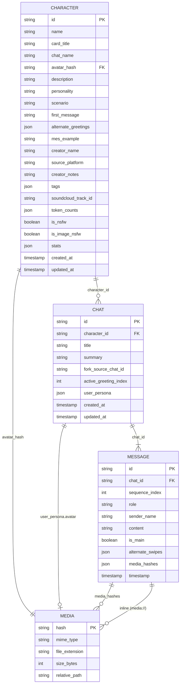
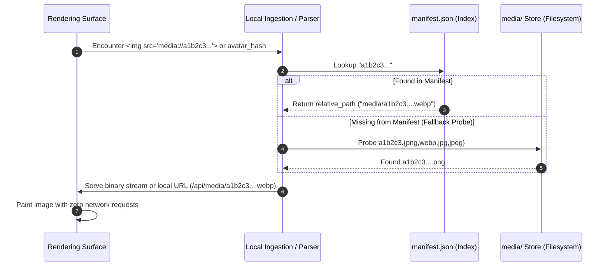

# Custom Engine RP Data Architecture & Specification Analysis
**A Technical Review of Normalized Content-Addressed Relational Roleplay Archives**

- **Document Type:** Technical Architecture Report
- **Status:** Living Document / Historical Reference
- **Related Specifications & Datasets:**
  - Ingestion Specification: [`custom_rp_data_specification.md`](file:///S:/WorkSpace/Projects%20Workspace/Python/JAI_Migration/docs/custom_rp_data_specification.md)
  - Dataset Directory: `S:\WorkSpace\Projects Workspace\Python\JAI_Migration\exports\custom_engine/`
  - Transpiled Counterpart: `S:\WorkSpace\Projects Workspace\Python\JAI_Migration\exports\sillytavern/`
  - Comparative Partner Report: [`sillytavern-import-export-analysis.md`](file:///s:/WorkSpace/Git%20Workspace/FormaTavern/docs/history/reports/sillytavern-import-export-analysis.md)

---

## 1. Executive Summary & Context

The roleplay (RP) and character card ecosystem has historically evolved through ad-hoc, convention-driven community standards. Formats like **Character Card V2 (CCv2 PNG/JSON)**, **Character Card V3 (CCv3 / CharX)**, and **SillyTavern JSONL Chat Logs** were engineered primarily as lightweight exchange envelopes for isolated entities (a single bot card or a flat transcript of dialogue). 

When large-scale conversational datasets are migrated from hosted platforms (such as JanitorAI) into local, self-hosted environments, these traditional exchange formats encounter critical architectural bottlenecks. They fail to handle global media deduplication, multi-branch conversation history, per-session user persona snapshots, and multi-scenario tracking without data truncation or format fracturing.

To address these shortcomings during large-scale migration, the **Custom Engine RP Data Architecture** was conceived. Documented in [`custom_rp_data_specification.md`](file:///S:/WorkSpace/Projects%20Workspace/Python/JAI_Migration/docs/custom_rp_data_specification.md) and materialized in `exports/custom_engine/`, this format models an entire roleplaying domain not as isolated cards, but as a **normalized, content-addressed, relational database-in-a-folder**.

### Primary Invariants of the Format

1. **Zero External Hotlinks:** Eliminates brittle remote URLs (e.g. `ella.janitorai.com`). All media binaries are stored locally.
2. **Zero Scraper Path Coupling:** Eliminates hardcoded local filesystem paths (`C:\Users\...`). Assets are referenced solely through abstract cryptographic identifiers.
3. **Cryptographic Content Addressing:** Media storage is deduplicated across the entire library using SHA-256 digests.
4. **Decoupled Relational Entities:** Characters, chat sessions, dialogue turns, and media assets are partitioned into first-class relational entities with explicit foreign-key linkages.
5. **Session-Specific State Preservation:** Multi-greeting indices and point-in-time user persona snapshots are preserved at the conversation level, preventing historical context contamination.

This report conducts an exhaustive technical examination of this architecture: its storage layout, relational models, media resolution mechanics, structural advantages, and architectural trade-offs.

---

## 2. Directory Topography & Storage Model

The physical packaging of `exports/custom_engine/` separates master metadata, domain entities, and binary assets into discrete, deterministically addressable partitions.

```
exports/custom_engine/
├── manifest.json                     # Master registry, inventory metrics & media schema
├── characters/                       # Entity partition: Character definitions
│   ├── 000150a0-07bf-4e2a-a92c-....json
│   ├── 002dada5-e3b9-4a00-9ba1-....json
│   └── ... (1,623 files)
├── chats/                            # Entity partition: Grouped chat sessions
│   ├── 000150a0-07bf-4e2a-a92c-.../
│   │   ├── 1566553883.json
│   │   └── ...
│   └── ... (1,623 subdirectories)
└── media/                            # Content-addressed binary blob store
    ├── 44326304f3cbe987ced888a14600cf06442eaca8935899e8e5a9ec2a8a48fe8a.png
    ├── a78a69644a798130b9c9b55e95b92ffe23862af119b0b6ee5df8e427555cb50a.webp
    └── ... (Deduplicated binaries)
```

### 2.1. The Master Inventory: `manifest.json`

At the root of the archive sits `manifest.json` (~469 KiB in the migration dataset). It functions as both a database header and an $O(1)$ fast lookup index for the media subsystem:

```json
{
  "version": "1.0.0",
  "generated_at": "2026-02-04T22:15:30Z",
  "source_platform": "janitorai_migration",
  "counts": {
    "characters": 1623,
    "chats": 1623,
    "messages": 48210,
    "media_assets": 1845
  },
  "media_assets": [
    {
      "hash": "44326304f3cbe987ced888a14600cf06442eaca8935899e8e5a9ec2a8a48fe8a",
      "mime_type": "image/png",
      "file_extension": ".png",
      "size_bytes": 76278,
      "relative_path": "media/44326304f3cbe987ced888a14600cf06442eaca8935899e8e5a9ec2a8a48fe8a.png"
    }
  ]
}
```

The master manifest provides two vital architectural guarantees:
1. **Pre-flight Integrity Checking:** An ingesting engine can verify file counts, byte sizes, and SHA-256 checksums before reading domain records.
2. **Deterministic MIME Resolution:** Because filenames on disk or remote headers can misreport MIME types, the manifest records the canonical MIME type and exact byte length discovered during ingestion.

---

## 3. Relational Entity Schema Deconstruction

The custom engine architecture enforces a clean four-tier relational schema:



---

### 3.1. The `Character` Entity

The `Character` record preserves bot definitions while decoupling display identity from platform metadata.

| Field | Type | Domain Role | Architectural Rationale |
| :--- | :--- | :--- | :--- |
| `id` | `TEXT` (PK) | Globally unique identifier (UUID) | Stable key independent of character name mutations. |
| `name` | `TEXT` | Canonical in-universe dialogue name | Used in prompting (`{{char}}`) and dialogue tags. |
| `card_title` | `TEXT` | Public platform listing title | Retains marketplace listing titles (e.g. `"Lily - Your Roommate"`). |
| `chat_name` | `TEXT` (Nullable) | Platform chat alias | Supports cases where a platform defines an explicit conversational alias different from `name`. |
| `avatar_hash` | `TEXT` (FK) | SHA-256 digest | Relational foreign key into the `Media` store. Zero paths. |
| `description` | `TEXT` | Public backstory / author pitch | Formatted markdown/HTML detailing context and author instructions. |
| `personality` | `TEXT` | Core system traits (`<Persona>`) | Invariable personality definitions for system prompts. |
| `scenario` | `TEXT` | Initial setting (`<Scenario>`) | Starting scenario parameters. |
| `first_message` | `TEXT` | Canonical opening dialogue | Primary default greeting turn. |
| `alternate_greetings` | `JSON (Array)` | Array of alternative openings | Supports multi-scenario cards natively as an indexed string array. |
| `mes_example` | `TEXT` | Dialogue demonstrations | One-shot or few-shot dialogue patterns (`<START>`). |
| `creator_name` | `TEXT` | Original author handle | Attribution tracking. |
| `source_platform` | `TEXT` | Origin ecosystem | Provenance indicator (`"janitorai"`, `"chub"`, `"custom"`). |
| `creator_notes` | `TEXT` | Author warnings / tips | Non-prompt metadata intended for human players. |
| `tags` | `JSON (Array)` | Genre and content tags | Categorization index (`["Drama", "Romance", "OC"]`). |
| `soundcloud_track_id`| `TEXT` (Nullable) | Audio theme identifier | Preserves JanitorAI ambient soundtrack links. |
| `token_counts` | `JSON (Object)` | Precomputed token metrics | Pre-calculated sub-component token costs (`personality`, `scenario`, `first_message`, `total`). |
| `is_nsfw` | `BOOLEAN` | Content maturity flag | Safe-search filtering. |
| `is_image_nsfw` | `BOOLEAN` | Visual maturity flag | Avatar blur rendering triggers. |
| `stats` | `JSON (Object)` | Historical engagement metrics | Captures community statistics (`chat_count`, `msg_count`). |
| `created_at` / `updated_at` | `TIMESTAMP` | ISO-8601 temporal stamps | Historical lifecycle tracking. |

#### Architectural Insight: Token Breakdown Metadata
Standard character cards either omit token counts or record a single unverified integer in an extension field. `custom_engine` explicitly partitions token counts:
```json
"token_counts": {
  "personality_tokens": 1050,
  "scenario_tokens": 300,
  "first_message_tokens": 450,
  "total_tokens": 1800
}
```
This enables an ingesting engine or user interface to display immediate memory footprint breakdowns without requiring an expensive tokenization pass across thousands of characters at boot time.

---

### 3.2. The `Chat` Entity

The `Chat` record decouples conversational sessions from the global application state. In traditional clients, chats are either loose log files or unversioned arrays appended to character folders.

| Field | Type | Description |
| :--- | :--- | :--- |
| `id` | `TEXT` (PK) | Session identifier (platform ID or UUID). |
| `character_id` | `TEXT` (FK) | Foreign key pointing to `Character.id`. |
| `title` | `TEXT` | User-defined or auto-generated session label. |
| `summary` | `TEXT` | Long-term memory summary generated during the roleplay. |
| `fork_source_chat_id` | `TEXT` (Nullable) | Identifies the parent session if this chat was branched. |
| `active_greeting_index`| `INTEGER` | Points to the greeting variant used (`0` = `first_message`, `1..N` = `alternate_greetings[N-1]`). |
| `user_persona` | `JSON (Object)` | Point-in-time snapshot of the user's roleplay identity for this specific session. |
| `created_at` / `updated_at` | `TIMESTAMP` | Session lifecycle timestamps. |

#### Architectural Insight: The `user_persona` Snapshot
In traditional roleplay applications (e.g. SillyTavern), the user persona is a global singleton. If a user modifies their persona from "Detective Miller" to "Sir Galahad," reopening an archived detective chat causes the engine to evaluate the current persona, corrupting the prompt context of the historical chat.

`custom_engine` resolves this by embedding a complete point-in-time snapshot directly in the session record:
```json
"user_persona": {
  "name": "Anon",
  "description": "A 25 year old university student majoring in literature.",
  "avatar": "10758d39c7f4884cf3e8886287614d818d1cebe82f686442a06918cdcaebffd3",
  "pronouns": "he/him"
}
```
This guarantees that historical conversations remain perfectly immutable and self-contained forever.

#### Architectural Insight: `active_greeting_index`
When characters define multiple scenario greetings, standard chat exporters simply copy the text of the selected greeting into message turn 0. Once exported, the relationship between the chat and the character's scenario list is severed. 

By recording `active_greeting_index: 2`, `custom_engine` explicitly preserves the structural link: the client knows that this session was initialized from the author's third alternate scenario, enabling features like scenario-based analytics, reset-to-scenario actions, and contextual branch tracking.

---

### 3.3. The `Message` Entity

A `Message` represents a single conversational turn within `chat.json`.

```json
{
  "id": "2003296886_0",
  "sequence_index": 0,
  "role": "assistant",
  "sender_name": "Lily",
  "content": "Hey... are you already awake?\n\n",
  "is_main": true,
  "alternate_swipes": [
    "Hey... sorry if I woke you up early."
  ],
  "media_hashes": [
    "fda8fc052bd7b64e33c71e46f3892ab3ac6f1824482a4f97ce1e838b6a1e81d8"
  ],
  "timestamp": 1756479600000
}
```

Key features of this structure:
1. **Explicit Monotonic Sequencing (`sequence_index`):** Ensures deterministic linear ordering independent of file system serialization or database insertion order.
2. **First-Class Swipe Preservation (`alternate_swipes`):** Unchosen LLM responses generated for this turn are preserved directly on the message node rather than dropped or placed in disconnected tree structures.
3. **Dual Media Modeling (`media_hashes` + `media://` URIs):** Handles both standalone image attachments and inline narrative illustrations seamlessly.

---

## 4. The Content-Addressed Media Protocol (`media://{sha256}`)

One of the most technically refined components of the `custom_engine` specification is its **content-addressed media subsystem**.



### 4.1. The 4 Concrete Media Pointer Types

Every visual asset across the entire dataset belongs to one of four distinct functional channels:

| Pointer Type | Field Location | Format | Functional Purpose |
| :--- | :--- | :--- | :--- |
| **1. Character Avatar** | `Character.avatar_hash` | 64-char Hex SHA-256 | Primary character portrait/card art. |
| **2. User Persona Avatar** | `Chat.user_persona.avatar` | 64-char Hex SHA-256 | User visual identity for the specific chat session. |
| **3. Inline Narrative Art** | `Character.description`<br>`Character.first_message`<br>`Message.content` | `media://{sha256}` URI | Embedded illustrations within markdown/HTML text flows. |
| **4. Turn Attachments** | `Message.media_hashes` | Array of SHA-256 strings | Standalone image attachments sent or generated in a turn. |

### 4.2. URI Resolution Mechanics

Inline illustrations are formatted using an abstract RFC-compliant URI scheme:
```markdown

```
or raw HTML:
```html

```

When an ingesting application or markdown parser processes this text, it intercepts all occurrences matching the regex pattern:
`media://([a-f0-9]{64})`

The engine resolves the capture group `\1` against `manifest.json` and dynamically rewrites the URI to:
- A local API route (e.g. `/api/assets/fda8fc052bd7b64e.../content`), or
- A local file URI (e.g. `file:///.../media/fda8fc052bd7b64e....png`), or
- A browser Blob URL generated from cache.

**Crucial Invariant:** The source text stored in the database remains unmodified (`media://{hash}`). Dynamic URL resolution occurs strictly at the rendering boundary. This keeps the stored text completely decoupled from hostnames, ports, and storage mount points.

---

## 5. Architectural Evaluation: Strengths & Advantages

A rigorous evaluation reveals several deep architectural advantages that make `custom_engine` superior to conventional roleplay formats for local data ownership.

### 5.1. Complete Immunity to Asset Link Rot
- **The Failure in Legacy Formats:** Scraped characters and chats from web platforms typically contain hotlinks pointing to third-party CDNs (e.g., Cloudflare, AWS S3, `janitorai.com`). Within months, CDNs rotate tokens, authors delete images, or domains change, leaving card descriptions and chat logs littered with broken `404 Not Found` image boxes.
- **The `custom_engine` Advantage:** By mandating that all media be downloaded, hashed, and rewritten to `media://{sha256}` at export time, the package becomes **100% offline-first and self-sufficient**. It will render identically 20 years from now with zero internet access.

### 5.2. Maximal Storage Efficiency via Content Deduplication
- **The Failure in Legacy Formats:** When users download multiple characters from the same author or generate reaction images in multiple chat branches, legacy tools save duplicate image files inside each character's folder or inline massive base64 strings into JSON logs. A 5 MB avatar shared across 10 alternate cards consumes 50 MB of disk space. Base64 strings inflate raw byte size by ~33% and severely degrade JSON serialization and parsing speeds.
- **The `custom_engine` Advantage:** Media storage is globally content-addressed. In the analyzed dataset (`1,623` characters and `1,623` chats), 1,845 unique media assets serve tens of thousands of potential image placements. Duplicates collapse automatically to the same hash.

### 5.3. Preservation of Contextual RP History
- **The Failure in Legacy Formats:** As detailed in Section 3.2, global user personas in apps like SillyTavern introduce state contamination. Changing your username or profile breaks the narrative coherence of historical chats.
- **The `custom_engine` Advantage:** Embedding immutable user persona snapshots directly into each `chat.json` preserves the exact roleplay persona you used during that specific adventure.

### 5.4. High-Fidelity Multi-Scenario Lineage
- Characters with rich alternate greetings (e.g., different historical eras, alternative relationship dynamics) are not flattened into simple string arrays that lose context upon chat creation. The chat explicitly remembers its `active_greeting_index`, maintaining full provenance back to the character definition.

### 5.5. High-Throughput Ingestion Profile
- The separation of entities into discrete JSON files grouped by character ID allows concurrent, chunked ingestion into relational databases. An ingesting worker can read `manifest.json`, stream all media binaries into storage concurrently, and batch-insert characters and chats without holding the entire dataset in memory.

---

## 6. Architectural Evaluation: Weaknesses & Trade-Offs

Despite its architectural elegance as a database archive, `custom_engine` has several distinct disadvantages and operational trade-offs that must be acknowledged.

### 6.1. Ecosystem Isolation & Zero Interoperability
- **The Primary Drawback:** `custom_engine` is a custom format. No third-party platform (SillyTavern, Chub.ai, Backyard AI, KoboldAI, Discord bots) understands this directory structure natively.
- **Consequence:** You cannot drag-and-drop a character from `custom_engine` into another client or share it on Discord. To interact with the broader community, data must undergo an active transpilation step into TavernCard V2/V3 or CharX.

### 6.2. Non-Atomic Distribution (The Single-File Problem)
- **The Packaging Issue:** The universal success of the TavernCard V2 standard stems from its **atomicity**: the character image, metadata, and prompt are embedded inside a single `.png` file. A user can download one file and immediately start playing.
- **The `custom_engine` Bottleneck:** A character in `custom_engine` cannot be distributed in isolation without bundling its referenced avatar from `media/{avatar_hash}.*`, any inline images from `media/`, and its associated chat JSONs. It is an archive format meant for bulk backups, not an exchange format meant for peer-to-peer sharing.

### 6.3. Filesystem Inode Overhead & Directory Clutter
- **The I/O Penalty:** In `exports/custom_engine/`, 1,623 characters and 1,623 chats result in thousands of individual small JSON files and subdirectories. On Windows filesystems (NTFS), traversing thousands of nested small files during directory scans or anti-virus inspections introduces measurable I/O latency compared to a single compressed archive (ZIP) or an embedded database (SQLite).

### 6.4. Garbage Collection Burden on Deletion
- **The Orphaned Asset Hazard:** In a content-addressed storage pool, deleting a character or a chat cannot simply delete the associated media file, because other characters or chats might reference that same SHA-256 hash. 
- **Consequence:** Any engine managing this format must implement a two-phase garbage collection mechanism (mark-and-sweep reference counting) to safely purge unreferenced media files from disk.

---

## 7. Comprehensive Cross-Format Comparison Matrix

The table below contrasts `custom_engine` against the major existing card and chat specifications in the AI roleplay ecosystem.

| Dimension | `custom_engine` | TavernCard V2 (PNG) | CharX / CCv3 (`.charx`) | SillyTavern JSONL | Backyard AI (`.byaf`) |
| :--- | :--- | :--- | :--- | :--- | :--- |
| **Architectural Scope** | Full Relational Backup | Single Character | Multi-Asset Character | Single Chat Log | Character + Chats Package |
| **Primary Container** | Directory + Manifest | Single PNG Image | Single ZIP Archive | Plaintext JSON Lines | Single ZIP Archive |
| **Chat History Support** | **Full** (Multi-chat trees) | ❌ None | ❌ None | **Full** (Linear + Swipes) | **Full** (Linear) |
| **Media Architecture** | **Content-Addressed (SHA-256)** | Embedded in PNG header | Embedded in ZIP (`assets/`) | Local disk paths (`user/images`) | Embedded in ZIP |
| **Global Deduplication** | **Yes** (Across all cards/chats) | ❌ No | ❌ No (Scoped to single card) | ❌ No | ❌ No |
| **Per-Chat User Persona** | **Yes** (Immutable snapshot) | ❌ None | ❌ None | Partial (Header name only) | ❌ No |
| **Multi-Greeting Tracking** | **Yes** (`active_greeting_index`) | Array only (Untracked in chat) | Array only (Untracked in chat) | Partial (`chat_metadata`) | ❌ No |
| **Inline Media Protocol** | **Yes** (`media://{sha256}`) | ❌ No (Raw URLs or Base64) | Partial (Local asset paths) | Local paths or Base64 | Local asset paths |
| **Provenance & Token Data** | **Yes** (Detailed breakdowns) | ❌ Extensions only | ❌ Extensions only | ❌ Header only | ❌ Limited |
| **Ecosystem Portability** | ❌ Proprietary / Custom | **Universal (Standard)** | **High (Emerging Standard)** | **Universal (For Chats)** | Low (Backyard AI only) |
| **Single-File Sharing** | ❌ No (Requires export pack) | **Yes** (Instant drag-and-drop) | **Yes** (Instant drag-and-drop) | **Yes** (Per chat) | **Yes** (Whole bundle) |

---

## 8. Strategic Takeaways for Modern RP Engines

Analyzing the architecture of `custom_engine` alongside existing community standards reveals a clear design imperative for modern local roleplay applications:

### 1. Two Tiers of Data Representation
Modern local RP clients must recognize that **Storage Architecture** and **Interchange Architecture** have diametrically opposed requirements:
- **The Storage Tier (Internal):** Must be relational, normalized, content-addressed, and ACID-compliant. It should adopt the principles of `custom_engine` (storing media by SHA-256 hash, decoupling entities, preserving persona snapshots, and tracking greeting indices in SQLite).
- **The Interchange Tier (External):** Must be atomic and broadly compatible. It should support importing and exporting single-file community standards (Character Card V2 PNGs, CCv3/CharX ZIPs, and SillyTavern JSONL transcripts).

### 2. The Ideal Ingestion Pipeline
When ingesting `exports/custom_engine/`, an engine does not need to perform complex schema contortions. Because `custom_engine` is already a normalized relational model, the ingestion pipeline is a direct, lossless transformation:
1. Stream `media/*` into the local asset pool indexed by SHA-256 hash.
2. Bulk insert `characters/*.json` into the local `characters` table.
3. Bulk insert `chats/*/*.json` into the local `chats` and `messages` tables, preserving user persona snapshots and alternate swipes.
4. Resolve `media://` URIs dynamically at the frontend render boundary.

### 3. The Transpilation Bridge
For users wishing to share characters from this archive with the broader community, an engine can provide an automated **lossy export bridge**:
- Transpile a character to **CCv2 PNG** (embedding the avatar, standard prompt fields, and serializing `token_counts`, `soundcloud_track_id`, and `stats` into `data.extensions`).
- Transpile a character to **CharX / CCv3** (packaging alternate greeting illustrations into `assets/`).
- Transpile a chat session to **SillyTavern JSONL** (mapping `user_persona` to line 0 metadata and extracting media attachments).

---

## 9. Conclusion

The `custom_engine` format is an exceptionally well-conceived data architecture for **local preservation, migration, and relational storage**. Its use of cryptographic content-addressing, decoupled entities, immutable persona snapshots, and abstract `media://` protocols solves the critical flaws of bit-rot, bloated file sizes, and context contamination that plague older community formats.

While its lack of single-file atomicity and ecosystem portability makes it unsuitable as an ad-hoc sharing card, it serves as an exemplary blueprint for how a local RP engine's internal persistence layer should be structured. Any modern client that aligns its internal data model with these principles achieves 100% lossless ingestion of large-scale roleplay archives while establishing an incorruptible foundation for future conversation management.
