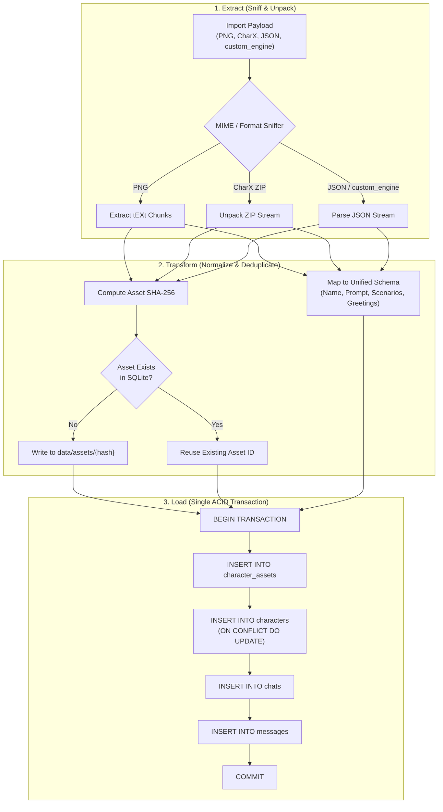
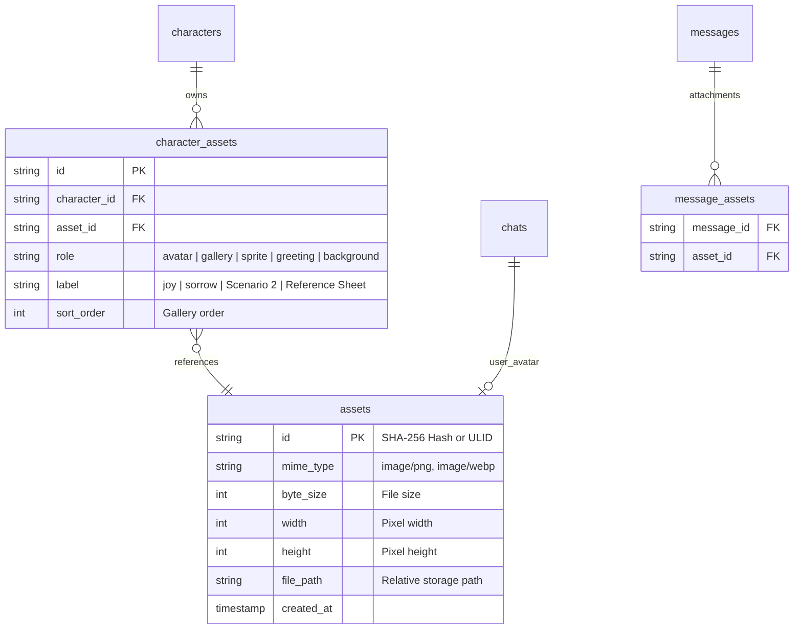
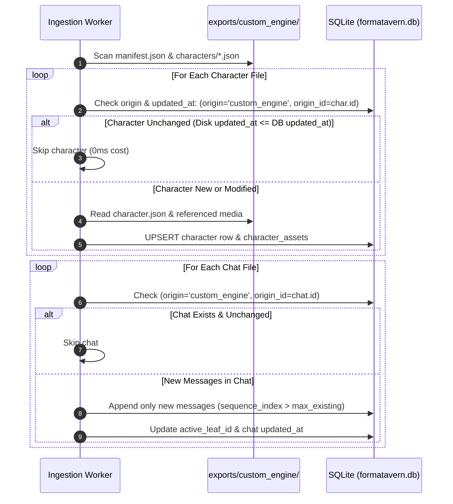

# Unified Import/Export Architecture Strategy
**Bridging Community Standards, Relational Database Efficiency, and Continuous Ingestion**

- **Document Type:** Architectural Blueprint & Synthesis Report
- **Status:** Living Technical Architecture Document
- **Related Prior Reports:**
  - Part 1: [`sillytavern-import-export-analysis.md`](file:///s:/WorkSpace/Git%20Workspace/FormaTavern/docs/history/reports/sillytavern-import-export-analysis.md) — Comprehensive technical review of SillyTavern's card/chat import/export formats, parsers, and edge cases.
  - Part 2: [`custom-engine-format-analysis.md`](file:///s:/WorkSpace/Git%20Workspace/FormaTavern/docs/history/reports/custom-engine-format-analysis.md) — Deep architectural critique of the `custom_engine` relational format, content-addressed media system, advantages, and trade-offs.
  - Ingestion Specification: [`custom_rp_data_specification.md`](file:///S:/WorkSpace/Projects%20Workspace/Python/JAI_Migration/docs/custom_rp_data_specification.md)

---

## 1. Executive Vision: Modernizing the RP Data Architecture

The AI roleplay ecosystem suffers from a deep architectural divide. On one side are client applications like **SillyTavern**, which rely on flat, un-indexed file systems, loose PNGs, and disconnected JSONL logs. On the other side are hosted platforms (like **JanitorAI**, **Chub**, or **Character.ai**), which run centralized relational databases with rich metadata, content-addressed media, and multi-branch conversations.

FormaTavern bridges this divide by adopting a **Database-First, Standards-Compatible Architecture**:
1. **Internally:** FormaTavern operates on an ACID-compliant **SQLite (WAL)** relational engine with a content-addressed binary store. All searches, branch traversals, persona swaps, and queries are fast ($O(1)$ or indexed $B\text{-Tree}$ lookups).
2. **Externally:** FormaTavern acts as a universal adapter. It can ingest and export traditional community cards (**TavernCard V2 PNG**, **Character Card V3 / CharX ZIP**, **SillyTavern JSONL Chats**) while natively synchronizing relational archives (**`custom_engine`**).
3. **Continuously:** Ingestion is not a one-time migration script. It is an **idempotent, incremental synchronization pipeline** capable of syncing 1,600+ characters in bulk or seamlessly ingesting a single newly created card or chat delta at any time.

---

## 2. What We Adopt vs. What We Reject from SillyTavern

To build a resilient platform, FormaTavern strategically absorbs the battle-tested strengths of the broader community while explicitly rejecting SillyTavern’s historical technical debt.

```
┌────────────────────────────────────────────────────────┐
│             FormaTavern Architectural Filter           │
├────────────────────────────┬───────────────────────────┤
│    ADOPT (Strengths)       │     REJECT (Legacy Debt)  │
├────────────────────────────┼───────────────────────────┤
│ • Universal V2/V3 Import   │ • Boot-time Disk Scanning │
│ • CharX ZIP Asset Parsing  │ • In-Place PNG Mutation   │
│ • ST JSONL Chat Parsing    │ • Brittle File Paths      │
│ • Seamless Drag & Drop     │ • Global Persona Bleed    │
│ • Rich Token / Tag Parsing │ • Unconstrained Orphans   │
└────────────────────────────┴───────────────────────────┘
```

### 2.1. Advantages We Adopt from SillyTavern

1. **Universal Card Ecosystem Ingestion:**
   FormaTavern natively parses the standard exchange formats used across Discord, Chub, and character repositories:
   - **TavernCard V2 PNG:** Extracts the `tEXt` / `iTXt` chunk containing `chara` or `ccv3` base64-encoded JSON.
   - **Standalone JSON:** Ingests raw V2/V3 card manifests.
   - **Character Card V3 / CharX (`.charx`):** Extracts multi-asset ZIP packages containing `card.json` and bundled media.
2. **SillyTavern Chat Interoperability:**
   FormaTavern accepts SillyTavern `.jsonl` chat transcripts. Line 0 chat metadata is unpacked, and subsequent dialogue turns—including alternate swipes and timestamps—are parsed into conversational nodes.
3. **Frictionless Ingestion UX:**
   Users can drag-and-drop any `.png`, `.json`, `.charx`, or `.jsonl` file directly onto the interface, with the client automatically sniffing headers and routing the payload to the appropriate ETL parser.

### 2.2. Legacy Baggage We Reject from SillyTavern

1. **Rejecting Boot-Time Filesystem Sprawl:**
   - *SillyTavern's Approach:* Scans `public/characters/` on every boot, opening thousands of PNGs, extracting text headers, and caching the entire library in Node.js heap memory.
   - *FormaTavern's Architecture:* Reads from SQLite. At startup, the app connects to `formatavern.db` in sub-millisecond time. A library of 10,000 characters loads instantly via indexed pagination (`LIMIT / OFFSET` or keyset cursors).
2. **Rejecting In-Place File Mutation:**
   - *SillyTavern's Approach:* When a user edits a character's description or scenario in the UI, SillyTavern re-encodes the entire PNG image on disk. A write interruption or system crash corrupts the binary file.
   - *FormaTavern's Architecture:* SQLite is the immutable source of truth. Character metadata updates are pure SQL transactions (`UPDATE characters SET description = ?`). Exported PNGs are generated deterministically on demand; source assets are never overwritten.
3. **Rejecting Brittle Local File Paths in Chat Logs:**
   - *SillyTavern's Approach:* Chat logs record hardcoded relative image paths (e.g. `user/images/reaction_12.png`). Moving the server, renaming a folder, or changing character names breaks image links permanently.
   - *FormaTavern's Architecture:* Uses abstract, content-addressed IDs (`media://{sha256}` or asset ULIDs). The location of the file on disk is completely decoupled from the text.
4. **Rejecting Global Persona Bleed:**
   - *SillyTavern's Approach:* Stores the user persona globally. Opening a chat from a year ago injects the user's *current* active persona into historical prompts.
   - *FormaTavern's Architecture:* Adopts `custom_engine`'s invariant: chats bind to a point-in-time `persona_id` or an immutable persona snapshot, preserving roleplay continuity indefinitely.
5. **Rejecting Orphaned State:**
   - *SillyTavern's Approach:* Deleting a character leaves loose chat files and image directories scattered on disk forever.
   - *FormaTavern's Architecture:* Foreign key constraints (`ON DELETE CASCADE` or `RESTRICT`) guarantee referential integrity across the entire database.

---

## 3. SQLite Relational Efficiency: ETL vs. File Dumping

In a file-based application, "importing" is merely copying a file into a folder. While this seems simple, the cost is paid continuously during runtime. In FormaTavern, importing is a structured **Extract, Transform, Load (ETL)** pipeline.



### 3.1. Performance Comparison: SQLite vs. Windows NTFS Filesystem

When importing a large collection like the migration dataset (**1,623 characters, 1,623 chats, and 48,210 messages**):
- **On Windows NTFS (Loose Files):** Creating ~50,000 discrete files requires 50,000 filesystem allocation entries, metadata flushes, and anti-virus directory inspections. This process typically takes **3 to 8 minutes** and severely fragments disk storage.
- **In SQLite (Single WAL Transaction):** Wrapping the ingestion inside `BEGIN TRANSACTION ... COMMIT` writes pages sequentially to the Write-Ahead Log. SQLite easily processes 15,000–25,000 inserts per second. The entire dataset of 1,623 characters and 48,000+ messages is ingested in **approximately 2 to 4 seconds**.

---

## 4. The Two-Tier Image & Semantic Asset Architecture

A critical innovation in FormaTavern is decoupling the **physical storage of a binary image** from its **semantic role in the roleplay experience**.

Community specifications like **CharX / CCv3** define rich asset types:
- `icon`: Main portrait
- `emotion`: Emotional expression sprites (happy, angry, blushing)
- `background`: Scene backdrops and wallpapers
- `user_icon`: User avatar
- `other`: Lore banners, maps, reference sheets

`custom_engine` introduces inline narrative illustrations via `media://{sha256}`. 

FormaTavern unifies all of these under a **Two-Tier Asset Model**.



### 4.1. Tier 1: The Physical Deduplicated Blob Pool
- Storage location: `data/assets/{sha256}.{ext}`.
- Every asset uploaded by a user, parsed from a `.charx` bundle, or imported from `custom_engine` is fingerprinted with **SHA-256**.
- If 20 characters share the same author banner or emotion sprite, it is physically written to disk **only once**.
- The `assets` table tracks file existence, MIME validation, dimensions, and byte sizes.

### 4.2. Tier 2: The Relational Semantic Binding Table (`character_assets`)
Rather than relying on fragile folder naming conventions (`/characters/Sarah/sprites/happy.png`), semantic roles are modeled as first-class relational rows:

```sql
CREATE TABLE IF NOT EXISTS character_assets (
  id           TEXT PRIMARY KEY,
  character_id TEXT NOT NULL REFERENCES characters(id) ON DELETE CASCADE,
  asset_id     TEXT NOT NULL REFERENCES assets(id) ON DELETE RESTRICT,
  role         TEXT NOT NULL CHECK (role IN ('avatar', 'gallery', 'sprite', 'greeting', 'background')),
  label        TEXT, -- 'happy', 'blushing', 'night_tavern', '0', '1'
  sort_order   INTEGER NOT NULL DEFAULT 0,
  created_at   INTEGER NOT NULL
);
CREATE INDEX IF NOT EXISTS idx_char_assets_role ON character_assets(character_id, role, label);
```

#### How the UI Leverages Semantic Bindings:
1. **Showcase Gallery:**
   ```sql
   SELECT a.*, ca.label FROM character_assets ca
   JOIN assets a ON ca.asset_id = a.id
   WHERE ca.character_id = ? AND ca.role = 'gallery'
   ORDER BY ca.sort_order ASC;
   ```
2. **Dynamic Expression Engine (CharX / SillyTavern Sprites):**
   When dialogue sentiment indicates `*smiles*` or matches expression `joy`:
   ```sql
   SELECT a.file_path FROM character_assets ca
   JOIN assets a ON ca.asset_id = a.id
   WHERE ca.character_id = ? AND ca.role = 'sprite' AND lower(ca.label) = 'joy';
   ```
3. **Scenario-Specific Greeting Banners:**
   When the user toggles to Alternate Greeting #2:
   ```sql
   SELECT a.file_path FROM character_assets ca
   JOIN assets a ON ca.asset_id = a.id
   WHERE ca.character_id = ? AND ca.role = 'greeting' AND ca.label = '2';
   ```

### 4.3. Chat & Dialogue Turn Media Resolution
For images inside conversations, FormaTavern adopts a dual-strategy:
- **Turn Attachments:** Stored in a lightweight join table `message_assets(message_id, asset_id)` for files directly attached to a prompt or returned by an image-generation model.
- **Inline Text Media:** Preserves `custom_engine`'s invariant: markdown strings store `media://{sha256}`. The frontend markdown component (`Markdown.svelte`) dynamically rewrites `media://` to `/assets/{sha256}` at render time. Stored text remains 100% host-agnostic and permanent.

---

## 5. Continuous, Incremental Ingestion Strategy

A critical requirement from the user is that **ingestion cannot be a one-time migration script**. The system must support:
1. Bulk initial ingestion of 1,623 characters and chats.
2. Continuous, ongoing delta syncs when new characters, greeting scenarios, or chat logs are added to the export directory over time.
3. Selective ingestion of a single character folder or chat file without reprocessing the entire dataset.

To achieve this without duplicating data or overwriting user progress, FormaTavern implements an **Idempotent Synchronization Ledger**.



### 5.1. Database Provenance Schema

To differentiate natively created FormaTavern characters from imported records, the schema maintains explicit provenance tracking:

```sql
-- Track source provenance directly on characters and chats
ALTER TABLE characters ADD COLUMN origin TEXT DEFAULT 'native';      -- 'native', 'custom_engine', 'sillytavern', 'chub'
ALTER TABLE characters ADD COLUMN origin_id TEXT;                   -- External platform or file UUID
ALTER TABLE characters ADD COLUMN origin_hash TEXT;                 -- Content hash of source file for dirty checking
CREATE INDEX IF NOT EXISTS idx_characters_origin ON characters(origin, origin_id);

ALTER TABLE chats ADD COLUMN origin TEXT DEFAULT 'native';
ALTER TABLE chats ADD COLUMN origin_id TEXT;
CREATE INDEX IF NOT EXISTS idx_chats_origin ON chats(origin, origin_id);
```

### 5.2. The Idempotent Ingestion Invariants

1. **Non-Destructive Upsert (`INSERT ... ON CONFLICT DO UPDATE`):**
   - When a character is re-imported, existing database rows are updated rather than deleted.
   - Foreign key relations to existing chats are preserved.
2. **Selective Message Appending:**
   - If a chat session from `custom_engine` receives new dialogue turns in a later export, the importer checks `MAX(sequence_index)` in the database and appends **only the newly added message turns**. Existing message IDs and user bookmarks are never dropped.
3. **Dirty-Checking via Content Hashing:**
   - The importer computes a fast hash of each `character.json`. If `origin_hash` matches the database record, the parser skips the file entirely. A re-scan of 1,600 unchanged characters takes **less than 150 milliseconds**.
4. **Targeted Ingestion Modes:**
   The backend provides two distinct ingestion entrypoints:
   - **`POST /api/import/sync` (Batch Sync):** Points to a directory root, runs change-detection, and applies deltas.
   - **`POST /api/import/single` (Selective Import):** Accepts a single file payload (a `.charx`, `.png`, or single `character.json`) for on-demand additions.

---

## 6. The FormaTavern Export Engine Design

Exporting in FormaTavern is the mirror-image of ingestion: the SQLite database is the clean, uncorrupted master record, and external interchange formats are generated on the fly.

| Target Format | Generation Pipeline | Data Preserved |
| :--- | :--- | :--- |
| **TavernCard V2 PNG** | Read character row $\rightarrow$ Fetch avatar from `assets` $\rightarrow$ Inject V2 JSON into PNG `tEXt` chunk (`chara`) $\rightarrow$ Stream to client. | Standard prompts, alternate greetings, avatar, tags. Extended metadata (`token_counts`, `origin`) serialized into `data.extensions`. |
| **Character Card V3 / CharX (`.charx`)** | Read character row $\rightarrow$ Query `character_assets` for all bound media $\rightarrow$ Build ZIP stream with `card.json` + `assets/{type}/` $\rightarrow$ Stream to client. | 100% of all images (avatar, sprites, emotion labels, gallery art, greeting banners). |
| **SillyTavern JSONL Chat** | Read chat row $\rightarrow$ Build line 0 metadata with `user_persona` $\rightarrow$ Traverse active message tree from root to `active_leaf_id` $\rightarrow$ Emit JSON lines. | Full conversation text, alternate swipes, roles, timestamps, user persona headers. |
| **Custom Engine Relational Pack** | Export character JSON, chat JSONs, and bundle associated `media/` blobs with an updated `manifest.json`. | 100% lossless relational dump with content-addressed media. |

Because exports are rendered dynamically from the database:
- Original source files are never mutated.
- The user can export the same character as a lightweight V2 PNG for Discord sharing, or as a full CharX archive for desktop backup, with a single click.

---

## 7. Comparative Summary of Ingestion Capabilities

The following matrix summarizes how FormaTavern handles data across all target formats:

| Capability | TavernCard V2 | CharX / CCv3 | SillyTavern JSONL | `custom_engine` Archive |
| :--- | :--- | :--- | :--- | :--- |
| **Ingestion Complexity** | Low (Single PNG read) | Moderate (ZIP extraction) | Low (Stream parsing) | Moderate (Relational mapping) |
| **Media Resolution** | Single avatar extracted | Multi-image to `character_assets` | Text paths rewritten | SHA-256 mapped to `assets` |
| **Multi-Scenario Support** | `alternate_greetings` array | `alternate_greetings` array | Message 0 text | Linked via `active_greeting_index` |
| **Sprite / Expression Support**| ❌ None | **Full** (`role='sprite'`) | ❌ None (Stored separately) | ❌ None |
| **User Persona Fidelity** | Global default | Global default | Line 0 metadata | **Full** (Per-chat snapshot) |
| **Incremental Sync Capable** | Manual re-upload | Manual re-upload | Single chat upload | **Automated delta sync** |

---

## 8. Conclusion & Strategic Next Steps

FormaTavern's database-backed architecture turns what used to be a messy filesystem-management problem into a high-performance, verifiable relational pipeline. 

By combining:
1. **Universal Community Ingestion** (V2, V3/CharX, SillyTavern JSONL),
2. **A Two-Tier Semantic Asset Engine** (`assets` + `character_assets`),
3. **An Idempotent, Continuous Sync Pipeline** for `custom_engine` datasets, and
4. **Dynamic On-Demand Exporters**,

FormaTavern establishes a robust data layer that preserves historical roleplay fidelity, eliminates asset rot, and allows the application to seamlessly scale to thousands of characters and conversations.
